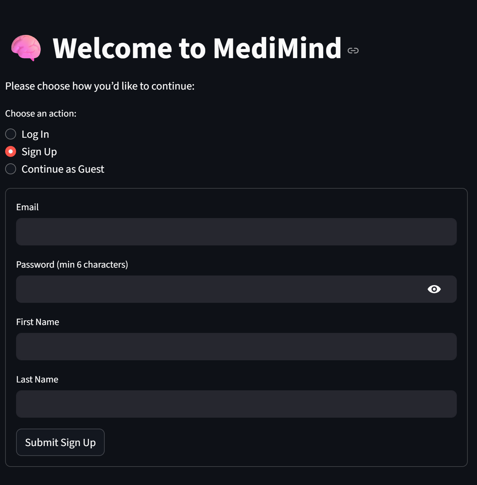
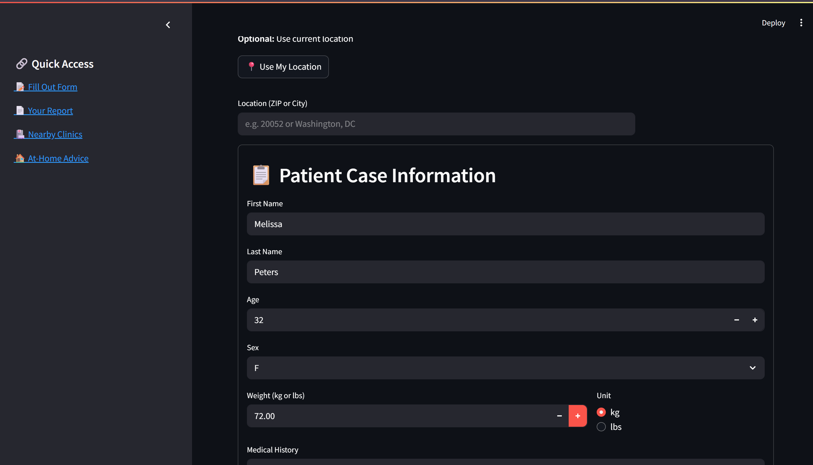
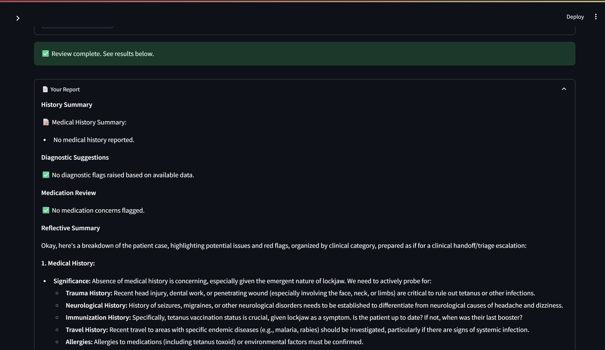
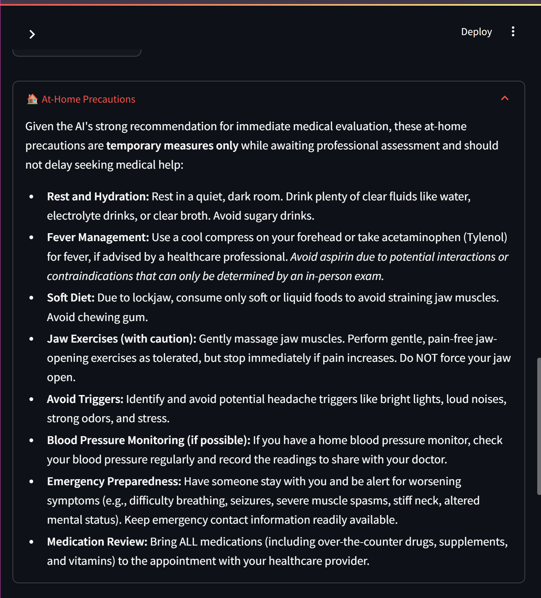
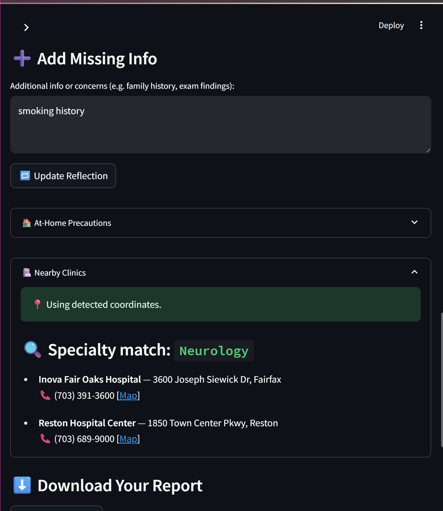
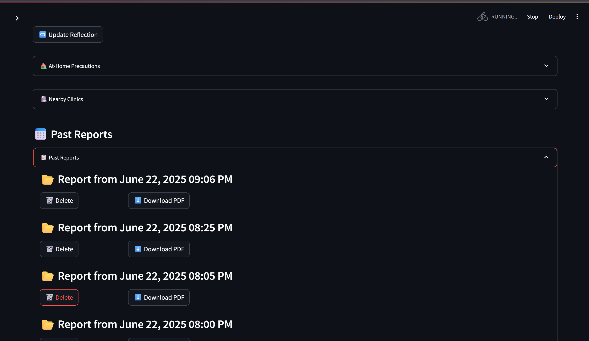
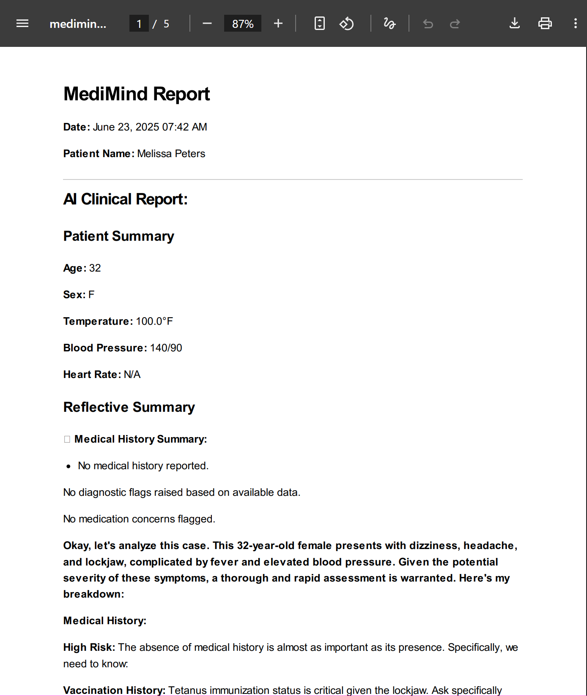
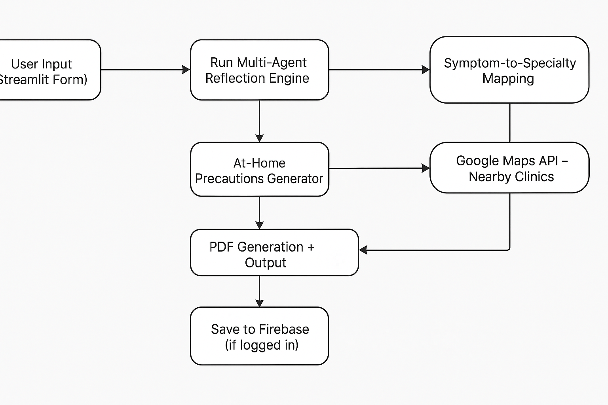

# 🧠 MediMind: Multi-Agent Clinical AI Assistant

[](https://medimind-606082995266.us-central1.run.app)  
A multi-agent system that helps clinicians and users analyze medical case data, generate reflective summaries, offer personalized at-home precautions, and find nearby specialty clinics.

---

## 🖼️ Demo & Screenshots

[🎥 Watch Demo Video](https://your-demo-video-url.com)

### 🏠 Homepage


### 📋 Patient Form Filled


### 📄 AI Reflection Output


### 🏠 At-Home Precautions


### 🏥 Nearby Clinics


### 📅 Past Reports (Logged-in View)


### 📄 PDF Report Preview


---

## 💡 Features

- ✍️ Fill out a structured form for medical symptoms, vitals, and history  
- 🤖 Reflective AI summary with multi-agent analysis  
- 🏠 Personalized at-home care recommendations  
- 🏥 Maps-based nearby clinic suggestions by specialty  
- 📍 Auto-geolocation support  
- 📄 Downloadable PDF report  
- 🔐 Firebase-based user login & past report saving  
- 🌐 Guest mode for one-time use  

---

## ⚙️ How It Works

<!-- Mermaid diagram (for local markdown viewers) -->

```mermaid
graph TD
    A[User Input (Streamlit Form)] --> B[Run Multi-Agent Reflection Engine]
    B --> C[AI Reflective Summary]
    B --> D[At-Home Precautions Generator]
    B --> E[Symptom-to-Specialty Mapping]
    E --> F[Google Maps API - Nearby Clinics]
    C --> G[PDF Generation + Output]
    D --> G
    F --> G
    G --> H[Save to Firebase (if logged in)]

## ⚙️ Architecture Diagram




---

## 🛠️ Built With

- **Python** – Core language  
- **Streamlit** – Frontend & app UI  
- **Google Vertex AI** – Gemini model for clinical reflection  
- **Agent Development Kit (ADK)** – Multi-agent orchestration  
- **Firebase Authentication & Firestore** – User login & report storage  
- **Google Places API** – Clinic lookup by symptom specialty  
- **Cloud Run** – Deployment platform  
- **PDFKit / WeasyPrint** – Report generation  

---

## 📚 What I Learned

- How to coordinate multiple AI agents to reflect on real medical data  
- How to build production-ready Streamlit apps integrated with Firebase  
- How to leverage Vertex AI for nuanced, human-like clinical reasoning  
- How to handle asynchronous user flow and evolving symptom sets  

---

## 🔭 What's Next

- 📊 Add biometric integration (e.g., Apple Watch, Fitbit)  
- 🧾 Visualize lab and vitals trends over time  
- 🌍 Multilingual and accessibility support  
- 🧑‍⚕️ Build clinician dashboards for ongoing care monitoring  

---

## 👥 Team

- Golsa Haftsavar – Project creator, lead, designer, developer  


---

## 📄 License

Licensed under the [MIT License](LICENSE).
