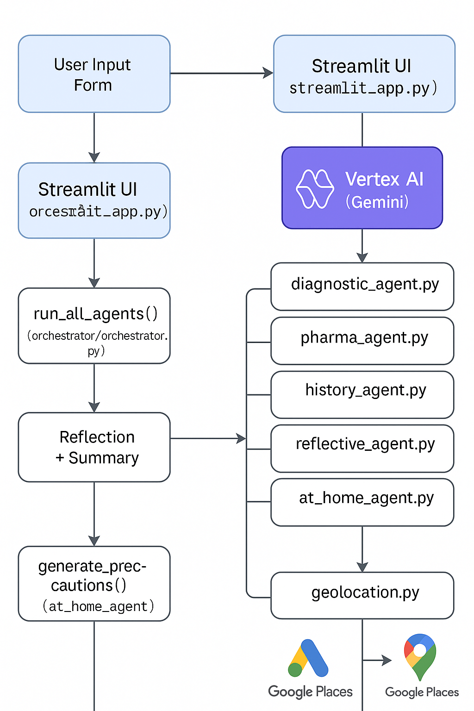

# 🧠 MediMind: Multi-Agent Clinical AI Assistant

  
A multi-agent system that helps clinicians and users analyze medical case data, generate reflective summaries, offer personalized at-home precautions, and find nearby specialty clinics.

---

## 🖼️ Demo & Screenshots

[🎥 Watch Demo Video](https://youtu.be/tMaGt4zxxGI)

### 🏠 Homepage

### 📋 Patient Form Filled

### 📄 AI Reflection Output

### 🏠 At-Home Precautions

### 🏥 Nearby Clinics

### 📅 Past Reports (Logged-in View)

### 📄 PDF Report Preview

---

## 💡 Features

- ✍️ Fill out a structured form for medical symptoms, vitals, and history  
- 🤖 Reflective AI summary with multi-agent analysis  
- 🏠 Personalized at-home care recommendations  
- 🏥 Maps-based nearby clinic suggestions by specialty  
- 📍 Auto-geolocation support  
- 📄 Downloadable PDF report  
- 🔐 Firebase-based user login & past report saving  
- 🌐 Guest mode for one-time use  

---

## ⚙️ How It Works

MediMind takes in user-submitted clinical data through a Streamlit form and routes it through a multi-agent reasoning engine. It produces AI-generated reflections, personalized care precautions, and maps-based clinic recommendations. All findings are compiled into a downloadable PDF report and optionally stored in Firebase for logged-in users.

## ⚙️ Architecture Diagram

---

## 🛠️ Built With

- **Python** – Core language  
- **Streamlit** – Frontend & app UI  
- **Google Vertex AI** – Gemini model for clinical reflection  
- **Agent Development Kit (ADK)** – Multi-agent orchestration  
- **Firebase Authentication & Firestore** – User login & report storage  
- **Google Places API** – Clinic lookup by symptom specialty  
- **Cloud Run** – Deployment platform  
- **PDFKit / WeasyPrint** – Report generation  

---

## 📚 What I Learned

- How to coordinate multiple AI agents to reflect on real medical data  
- How to build production-ready Streamlit apps integrated with Firebase  
- How to leverage Vertex AI for nuanced, human-like clinical reasoning  
- How to handle asynchronous user flow and evolving symptom sets  
- How to deploy apps to the cloud and protect keys to the different APIs

---

## 🔭 What's Next

- 📊 Add biometric integration (e.g., Apple Watch, Fitbit)  
- 🧾 Visualize lab and vitals trends over time  
- 🌍 Multilingual and accessibility support  
- 🧑‍⚕️ Build clinician dashboards for ongoing care monitoring  

---

## 👥 Team

- Golsa Haftsavar – Project creator, lead, designer, developer  

---

## 📄 License

Licensed under the [MIT License](LICENSE).
